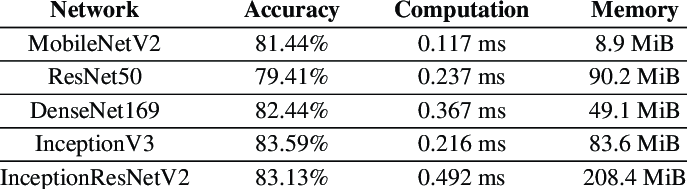
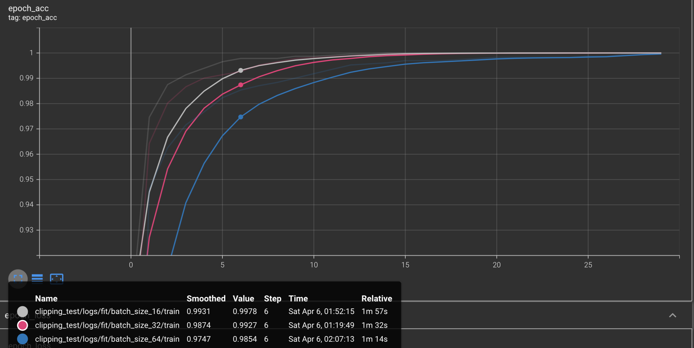
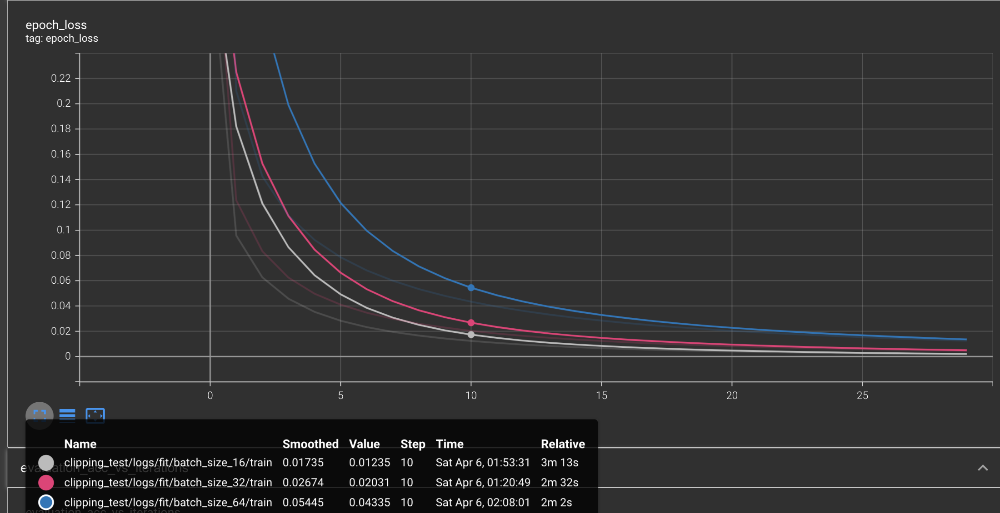
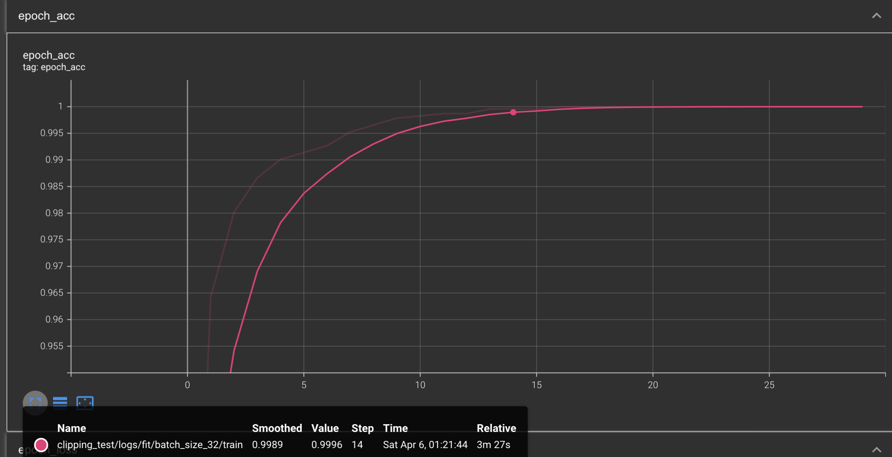
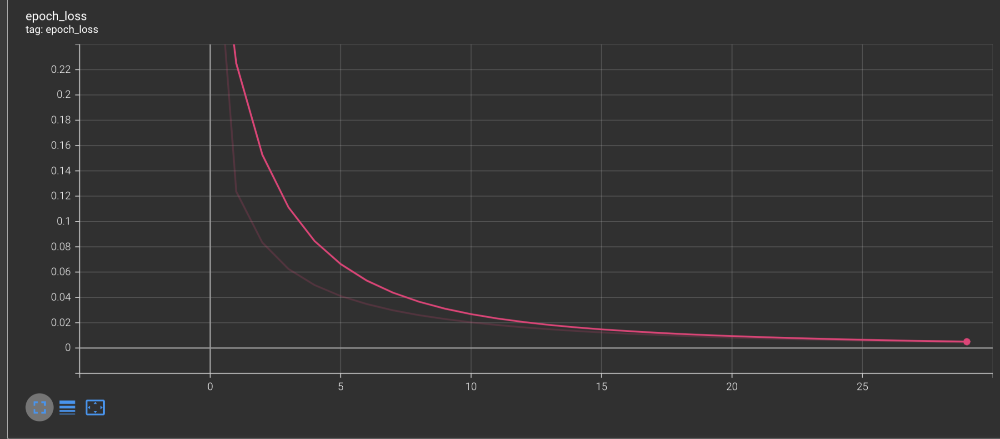
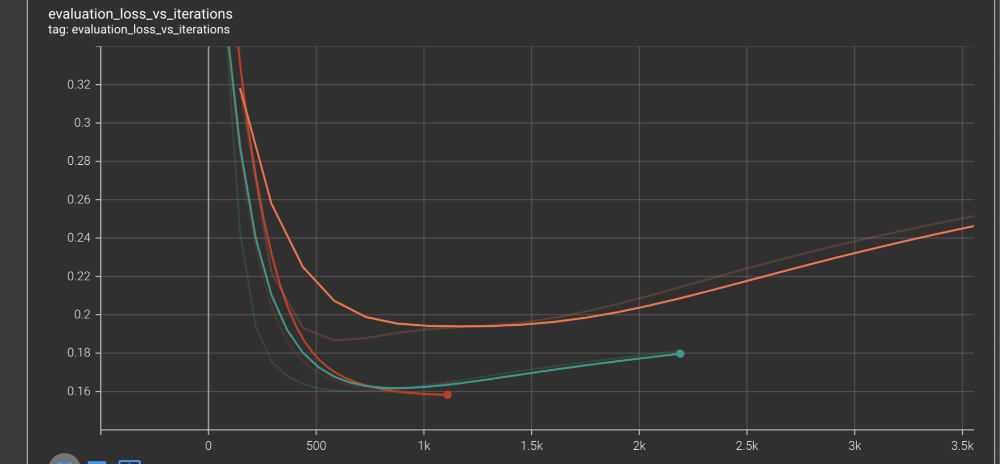

# **Model Architecture Selection**

In designing our machine learning model architecture, we chose MobileNetV2, a convolutional neural network tailored for resource-constrained devices like mobile and IoT devices[^1]. Its optimized structure facilitates rapid inference, crucial for real-time object detection tasks on mobile phones. Despite its compact nature, MobileNetV2 maintains competitive accuracy, ensuring dependable performance without imposing excessive demands on the device's hardware. This feature is especially advantageous for mobile applications where responsiveness and battery efficiency are paramount.

# **Model Training Approach**

We contemplated training the MobileNetV2 model from scratch, but this would have necessitated an extensive training period given our limited computing resources. Moreover, there was a risk of producing a less accurate model due to our constrained training data. Consequently, we adopted a transfer learning approach to develop our custom model.[^2]

In this approach, we utilized a pre-trained MobileNetV2 model with its final classification layer removed, effectively creating a headless version. This model was then fine-tuned on our dataset comprising router features. By leveraging the learned features of the existing model, we avoided the need to initiate training from scratch. Through joint training of the newly-added classifier layers and the last layers of the base model, transfer learning enabled us to swiftly develop an accurate model in an efficient manner.[^3]

# **Data Set**

To obtain images of router features we dowloaded an existing dataset from RoboFlow. The data set was labelled through bounding boxes using the RoboFlow platform. This ensured that we had a relatively large and robust dataset of 2351 labelled images that we could use to start training our model. The dataset consists of pictures of routers, and different cables taken from various sources such as the internet, manuals and phone cameras. The images also have lighting and quality variations that should make the dataset more varied and suitable for detecting router features in different settings.

# **Data Pre Processing**

Our training methodology involved feeding the model individual images of particular categories, we thus needed to separate the features defined by each of the bounding boxes on the images. This ensured that we could have images of power switches stored in a different directory of images of LAN ports thus making it easy for us to load the labelled data set into our training workflow using the Keras API. The downloaded data set came with a CSV file containing the two dimensional coordinates of the bounding box, its associated label and image. Thus we had to write a simple python script to traverse the CSV file, find the image, crop the image as per the coordinates and save it in a directory named after its label.

Before the images were used for training they were converted to a height and width of 224px so that they were in accordance with the expected input of the model. The images were then converted into `Numpy` arrays consisting of the RGB values from a scale of 0 to 255. These values were then normalised by dividing them 255 so they conform to input requirements of the MobileNetV2 model[^7] which accepts values in float 32 format.

# **Performance comparison**

As transfer learning employs a pre-trained model to fit it to new data, the underlying architecture of the model obtained through transfer learning is that of the original pre-trained model. In our case this model is the MobileNetV2 whose performance can be compared against other models based on standardised object recognition benchmarks[^4].

The table above illustrates the performance of MobileNetV2 alongside benchmark networks. Clearly, MobileNetV2 requires considerably less computational power and memory storage compared to the other four benchmark networks. Despite this substantial resource saving, there is only a slight decrease in accuracy compared to DenseNet169, InceptionV3, and InceptionResNetV2[^5]. In fact, MobileNetV2 even achieves a slightly higher average accuracy than ResNet50 on the dataset. In light of this, our requirement for a fast and accurate object detection model was perfectly met by the MobileNetV2 model.

# **Experiments**

### Design:

The Experiments were designed to test the impact of changing the model training hyper parameter of the **number of training epochs**, and **batch size.** For this approach, we have 3 datasets, a training dataset which is used to train the model, a validation dataset that is used to evaluate model performance during training and a test set that is used to independently ascertain the models performance after training. The performance of the model is evaluated on the basis of how accurately(%accuracy) it classifies the images from the training dataset as belonging to a certain category.

## Batch size

### Setup

For this experiment the learning rate, number of training epochs, training and validation sets were all kept constant. The batch sizes tested were 16, 32 and 64. The number of training epochs was set at 30, and the learning rate was set at at a default constant of 0.01. These results were obtained on an M1 pro laptop with 16gb ram.

_Model accuracy vs training epoch_

Increasing the batch size demonstrated that the time taken to train the model decreased significantly. For a batch size of 32 each epoch takes roughly 23 seconds on average while a batch size of 64 takes on average 11 seconds for each epoch to run. However, with this increase in training speed came a loss in accuracy as is evident by the lower blue graph compared with the grey and red graphs. This demonstrates that after each epoch the model with the batch size of 16 was the most accurate while the 64 batch size one was the least.

The loss in model accuracy is most accurately represented by the graph comparing the model’s training loss to number of epochs. The blue graph is above the other two graph demonstrating that the model trained with a batch size of 64 has the highest loss of the three batch sizes while the batch size of 16 has the lowest loss. A lower loss indicates better model performance.

Given these results, the team decided to use a batch size of 32 as it provided a good balance between performance and training time.

## Number of training epochs:

### Setup

For this experiment the learning rate, batch size, training and validation sets were all kept constant. The number of epochs were tested from 1 to 30. The batch size was set at 32, and the learning rate was set at at a default constant of 0.01. These results were obtained on an M1 pro laptop with 16gb ram.

As the model undergoes more training epochs, its accuracy increases. In our testing, the model’s accuracy began to approach 100% percent after 20 epochs. Training a model for an excessive number of epochs can cause it to overfit the data while not training it sufficiently can result in the model under fitting the data.

As the training loss of the model showed noticeable improvement after 25 epochs, the team decided to set the number of epochs at 30.

# **Issues encountered**

## Dependency issues encountered with libraries:

The teams initial approach to training a custom model was to use the TF lite model maker library which utilises transfer learning to create a custom tensor flow lite model in a few lines of code. This approach would have also been very reliable as we would not have to manually figure out such as normalisation parameters which can adversely impact performance. Unfortunately, this library had dependencies issues that made it impossible to use. Hours of searching on the internet led us to Open issues about the same errors we encountered and they are yet to be solved. We tried running the code in virtual environments, docker, different operating systems, and virtual machines but they all yielded the same error.

With no tangible solution, we decided to follow Googles guide on transfer learning to produce a custom TensorFlow model. We converted this TensorFlow model to a TensorFlow lite model using the TensorFlow lite converter library. Following the provided instructions also led to us finding many incompatible library issues but we managed to make the code run on our dataset and were able to obtain a TensorFlow model after countless internet searches. The issue happened to be with the Keras version used by TensorFlow and TensorFlow hub. The trained model was then relatively easy to convert to a TensorFlow lite model.

## Normalisation parameter:

The obtained TensorFlow lite model had to be paired with Meta data so that ML kit could run it[^6]. Using this Meta data, ML kit knows how to format the model input images, and what outputs to expect from the model. The metadata also included normalisation options which specify parameters for standard deviation and mean of the model since it takes input in Float32 format. When we added metadata to our model using the `tflite_support` library. We at first set the same normalisation option as MobileNetV2 and that resulted in the results from our application being overwhelming skewed to give one option with confidence above 100 percent. We tried to obtain the normalisation parameter from our dataset and saw some improvements in the classification performance of our app but there were still many instances where it incorrectly classifies features. Unfortunately, the guidance for choosing normalisation parameters for a custom model are not abundant and thus this topic requires further research.

## Poor Dataset:

The dataset needed to train the model needed to contain significant number of images to be sufficient for training. It would be a very time consuming process to take pictures of router feature and label them manual thus we decided to use the Roboflow database. The obtained pre-labelled dataset was large and diverse. This was processed to separate the features of the router for training. However, each of the separated feature contains images of low quality with features that are poorly defined. For instance, a power port is a low resolution image of a black circle which can result in the object detection model identifying many features besides the power port of the router as a power port. Training the model on such a dataset also presented issues with model overfitting to the training data as is evident by the increase in the training loss of the model after a few epochs of training on the validation dataset.

## General overview:

The overall performance of the models fell short of the team's expectations. Nevertheless, we successfully documented and demonstrated the process of training and integrating a custom model into our Android application, while identifying areas for improvement. Unfortunately, our progress was hindered by issues with dependency conflicts, consuming significant development time that could have been better utilised for troubleshooting and resolution, especially considering these challenges arose late in the development cycle. Additionally, given the complexity of our application's various features, we had to allocate time to other development priorities. Despite time constraints preventing further enhancements to the model, it is evident that with access to a better dataset and further research into model parameters, coupled with experimentation, a highly accurate and robust model can be created for our application.

# References
[^1]: A. Howard et al., “Searching for MobileNetV3,” arXiv.org, 2019. https://arxiv.org/abs/1905.02244
[^2]: N. Donges, “What is transfer learning? Exploring the popular deep learning approach,” Built In, Aug. 25, 2022. https://builtin.com/data-science/transfer-learning
[^3]: Google, “Transfer learning with a pretrained ConvNet | TensorFlow Core,” TensorFlow. https://www.tensorflow.org/tutorials/images/transfer_learning
[^4]: S.-H. Tsang, “Review: MobileNetV2 — Light Weight Model (Image Classification),” Medium, Aug. 01, 2019. https://towardsdatascience.com/review-mobilenetv2-light-weight-model-image-classification-8febb490e61c
[^5]: J. Shi, W. Wang, Y. Gao, and N. Yu, “Optimal Placement and Intelligent Smoke Detection Algorithm for Wildfire-Monitoring Cameras,” IEEE Access PP, vol. 99, Apr. 2020.
[^6]: Google, “Adding metadata to TensorFlow Lite models,” TensorFlow. https://www.tensorflow.org/lite/models/convert/metadata
