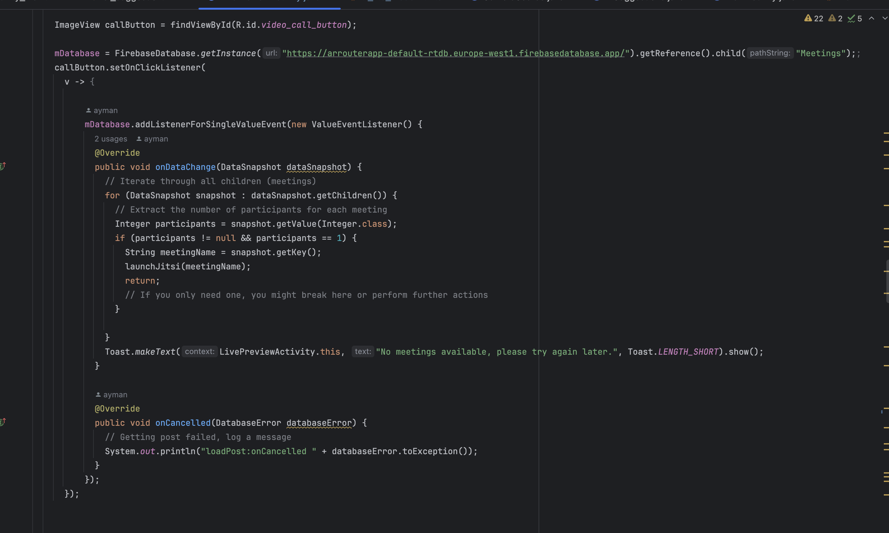
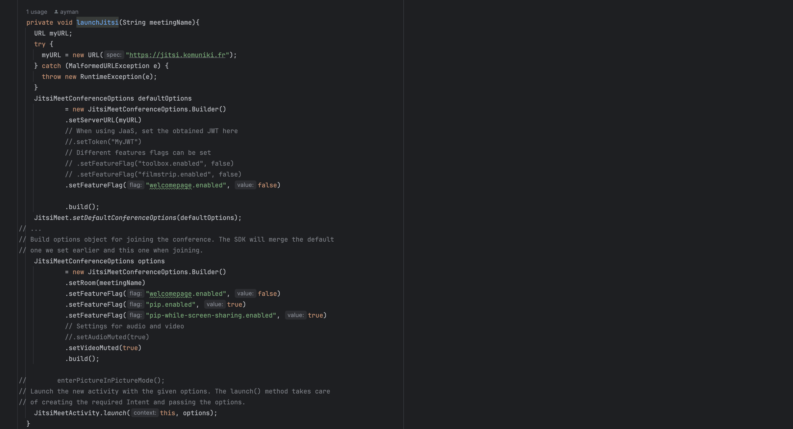
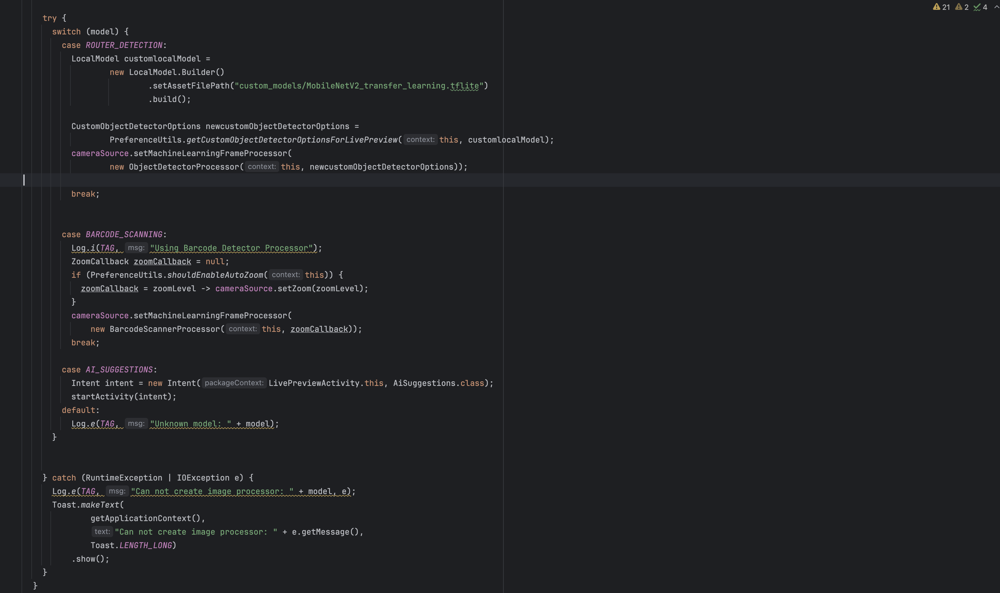
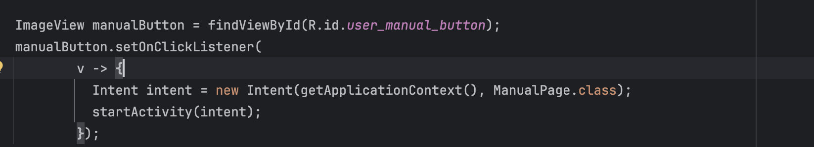
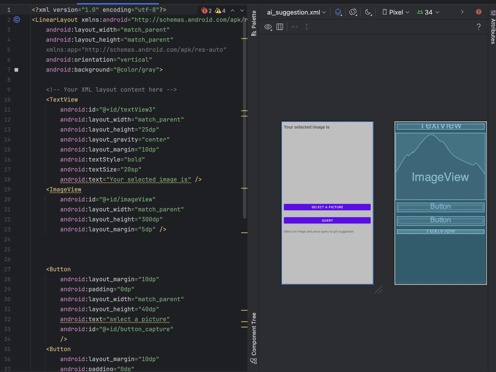

# System Architecture diagram

## Components:

### GPT Vision API:

Used to implement AI assistance feature. The API was queried with a base 64 image of the router as a prompt and the received response is displayed to the user in the application. The API internally processes the supplied prompt using the GPT 4 large language model.

### ML Kit SDK:

Provided the necessary APIs to detect router features visible within the users live camera feed based on inference from Machine learning model.

### TensorFlow lite machine learning model:

A machine learning model format designed for mobile and resource constrained devices. Encodes a custom Object detection model that detects router features. Model trained using transfer learning on MobileNetV2 model.

### TensorFlow:

Alongside Keras API, used to train a custom object detection model via transfer learning. Provided a high level API for data loading, data preprocessing and machine learning thus simplifying the process of training the model.

### Jitsi:

Open source video conferencing solution used to provide video conferencing functionality within the application. This feature was implemented using the Jitsi SDK for Android. The meetings are currently hosted on a public Jitsi server however, due to the open source nature of Jitsi, it is possible to host meetings on a private server.

### Firebase:

A cloud based, real time, NoSQL database that stores data in JSON file formats. Used to store room IDs of meetings currently in progress on Jitsi. A new meeting room ID would be created in the database when a senior engineer starts a meeting. This room would then be joinable by a single junior engineer. Once a meeting has 2 participants, it can’t be joined.

# Sequence diagram:

# Architectural pattern

## Model view controller:

The Model-View-Controller (MVC) pattern is a popular architectural choice in software development for its ability to enhance code organization, maintainability, and scalability. By dividing an application into three parts—model, view, and controller—MVC promotes modularity, testability, and scalability.

### Model:

The model represents the data and business logic of the application. Model-related operations such as Firebase database interactions (`updateMeetingParticipants()`, `onDataChange()`, `onCancelled()`) handle the data (meeting participants) and its manipulation such as adding participant or preventing users from joining a filled meeting room.

_Firebase database interactions part of the model layer_

_Jitsi launch function to deal with the business logic of starting a Jitsi meeting_

### Controller:

The controller acts as an intermediary between the model and the view. It handles user inputs, updates the model accordingly, and manipulates the view to reflect changes in the model. In our provided code, the LivePreviewActivity class plays the role of a controller. It responds to user interactions by invoking appropriate methods. It also manages the camera source and interacts with ML Kit processors by designating the machine learning model based on user selection.

_Choosing a machine learning model based on user selection._

_on click listener method to control what happens when the UI element is clicked._

### View:

Represents the user interface (UI) components responsible for presenting data to the user. Views display information and gather user input. Our views were designed in XML separately from our model and controller layers.

_XML code for view layer of AI suggestion activity_
